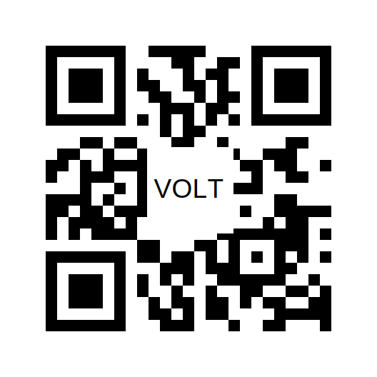

# qr codes
run qr_codes binary and add the uri param

- `uri` for mandatory code / uri to encode
- `letters` to add (optional) text into the middle part
- `square` to change the size of the square around the letters (default: 20)
- `font-size` to change the size of the font of the letters (default: 40)

## Exapmles
`qr_codes --uri volteuropa.org` \
`qr_codes --uri volteuropa.org --letters VOLT` \
`qr_codes --uri volteuropa.org --letters VOLT --square 23 --font-size 37`

This is the example's result: \

**Warning** \
Too long texts in the middle (too big squares) render the code broken as only 20-30% might be missing (error correction) to still have it working

## Todo
- add update routine

## Build
Running builds: \
`cargo build --release --target aarch64-apple-darwin` \
`cargo build --release --target x86_64-pc-windows-gnu` \
`cargo build --release --target x86_64-apple-darwin`

Fails: \
`cargo build --release --target x86_64-unknown-linux-gnu` \

#failing to compile from mac (cargo.toml addition)
[target.x86_64-unknown-linux-gnu]
linker = "x86_64-unknown-linux-gnu-gcc"